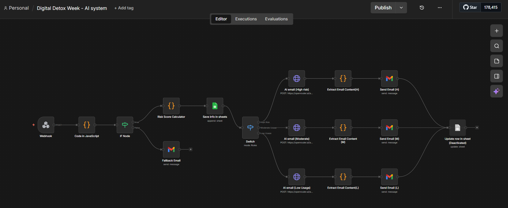

## Digital Detox Campaign — Automated Engagement Workflow

Tool: n8n (cloud)
Trigger: Webhook
Integrations: Google Sheets, Gmail, OpenRouter API

### What it does
Receives form submissions from campaign participants, validates data, calculates risk score based on daily screen time, and sends 
AI-generated personalised emails across three segments - High Risk, Moderate Usage, and Low Usage. 
All actions logged to Google Sheets with timestamps.

### Workflow Overview

